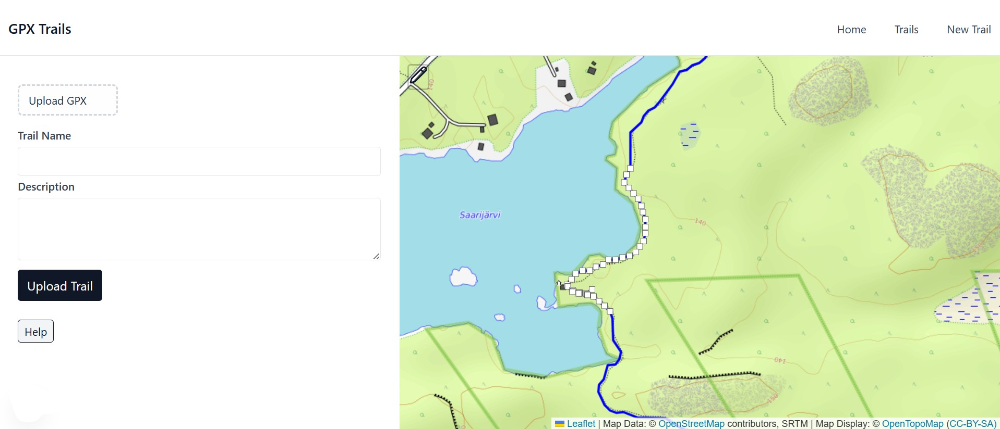

# GPXTrails

This is a work‑in‑progress project for sharing and working with GPX trail data in a clean, user‑friendly way. Information on trails is often scattered or behind pay walls and maps found online are often poor in quality. The goal of the project is to make it easier for runners, hikers and outdoor enthusiasts to find and share trail information.

GPX is a common dataformat for recording activities, and navigation, that most smart watches support. The idea behind this project is, when you go on a run or a hike, you can upload your recorded route from a GPX-file and edit out little detours and GPS failures, and post it on the platform. Now other people can find cool trails near them and download the GPX-file, look at the route on the map or just find new areas and ideas. Eventually the aim is to support also planning out routes that snap to actual trails.

## What It Does (So Far)

Current functionality includes:

* GPX upload/download and parsing
* Interactive map for editing trails
* Trail database
* Find trails on map
* Individual trail pages


<em>Trail editing/creation tool</em>

Planned features include:

* User authentication and deployment
* Trail filtering and search
* Geospatial search
* Extract more statistics (elevation change, etc.)
* Profile/settings page, view to see own trails
* Edit own existing trails
* Add images to trail descriptions
* Save/like trails
* Other social features?
* Import routes from Strava
* Navigation features on map (possible native application)
* Advanced editing features, including
  * Combining multiple gpx files
  * Deleting multiple points on a trail at once
  * Snap route to actual trails

---

## Tech Stack

* **Frontend:** React, Next.js
* **Backend:** Next.js
* **Database:** PostgreSQL
* **Mapping / Geo:** Leaflet, React Leaflet, Leaflet.Editable
* **Styling:** Tailwind CSS

---

## Getting Started (Development)

Clone the repository
```
git clone https://github.com/janisarja/gpxtrails.git
```

Install dependencies
```
npm install
```

Run the development server
```
npm run dev
```

---

## Database Setup

This project expects a PostgreSQL database named `trails_db` and the `postgres` user; the password and host are provided via environment variables (see below).

Quick steps (Windows / macOS / Linux):

- Install PostgreSQL: https://www.postgresql.org/download/
- Create the database (example using the `postgres` superuser):

Command-line:
```
psql -U postgres -c "CREATE DATABASE trails_db;"
```

If the `postgres` user has no password set, set one (replace `yourpassword`):

```
psql -U postgres -c "ALTER USER postgres WITH PASSWORD 'yourpassword';"
```

If you prefer a dedicated DB user, create one and grant privileges to `trails_db`.

## Environment variables

Create a `.env.local` file in the project root (this file is ignored by git) and add the following values:

```
DB_HOST=localhost
DB_PASSWORD=yourpassword
```

- `DB_HOST` should point to your Postgres host (e.g. `localhost` or a remote host).
- `DB_PASSWORD` is the password for the `postgres` user (or whatever DB user the app connects as).
